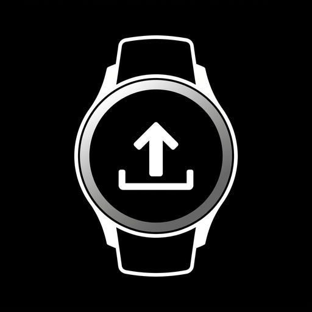

# Fenfa Watch Manager

<p align="center">
  
</p>

A standalone Android smartphone app designed to manage Wear OS watch apps distributed via a self-hosted [Fenfa](https://github.com/openprx/fenfa) server instance. It automatically detects new builds, downloads APKs, and seamlessly installs or updates them directly on your smartwatch using **Wireless ADB** — no PC, cables, or third-party tools (like Bugjaeger or Wear Installer) needed.

---

## ⌚ Compatibility

### Tested & Verified:
- ✅ **Samsung Galaxy Watch 8** (Wear OS 6.0 / One UI 8.0 Watch / Android 16)

### Supported Smartwatches:
The app works with **any smartwatch running Google Wear OS (Android)** that supports **Wireless Debugging (Wireless ADB)** in Developer Options:

* **Samsung Galaxy Watch:**
  * Galaxy Watch 8 *(tested & verified)*
  * Galaxy Watch 7 & Watch Ultra
  * Galaxy Watch 6 & Watch 6 Classic
  * Galaxy Watch 5 & Watch 5 Pro
  * Galaxy Watch 4 & Watch 4 Classic
  *(Note: Older Samsung watches running Tizen OS, such as Galaxy Watch 3 or Gear S3, are not supported)*
* **Google:** Pixel Watch, Pixel Watch 2, Pixel Watch 3
* **OnePlus:** OnePlus Watch 2, Watch 2R
* **Xiaomi:** Xiaomi Watch 2, Xiaomi Watch 2 Pro
* **Mobvoi:** TicWatch Pro 5, TicWatch Pro 3, TicWatch E3
* **Fossil / Skagen / Michael Kors:** Gen 6, Gen 5
* **Others:** TAG Heuer Connected, Montblanc Summit, Suunto 7, etc.

> [!NOTE]
> **Incompatible:** Smartwatches running proprietary operating systems (such as Garmin, Fitbit without Wear OS, Amazfit / Zepp OS, Huawei Watch with HarmonyOS, or Apple Watch with watchOS), as they do not run Android or provide ADB.

---

## ✨ Features

- **Fenfa OTA Sync**: Dual-host connectivity — checks for updates either over your local home Wi-Fi or securely over VPN / Tailscale.
- **Embedded Wireless ADB Client**: Direct connection to your smartwatch via the native Kotlin ADB library [`Kadb`](https://github.com/flyfishxu/Kadb) (no computer or external tools required).
- **Automatic mDNS Discovery**: Automatically scans your local Wi-Fi for watches with active wireless debugging (`_adb-tls-connect._tcp`) and extracts their dynamic connection port.
- **Persistent ADB Keypair**: Securely persists generated RSA keys (`kadb_key.pem`) in internal app storage so pairing authorization remains valid across app reboots and updates.
- **Multi-App Management**: Manage any number of Wear OS applications in one unified dashboard.
- **Version Comparison**: Inspects installed `versionCode` via ADB shell and compares it live against the newest release on your Fenfa server.
- **1-Click Installation**: Downloads APKs in the background and initiates `pm install` on the watch with live progress indicators.
- **Self-Update**: The manager checks for new versions of itself on Fenfa and enables seamless in-app self-updates via the Android `PackageInstaller`.

---

## 📱 Quick Start

### 1. Prepare your Smartwatch
1. On your watch: **Settings** → **About watch** → **Software info** → Tap **Software version** 7 times to enable Developer options.
2. Go back to **Settings** → **Developer options**:
   - Enable **ADB debugging**.
   - Enable **Wireless debugging**.

### 2. One-Time Pairing
1. On your watch inside *Wireless debugging*, tap **Pair new device**.
2. In **Fenfa Watch Manager** on your phone, tap **Pair**.
3. Enter the watch IP address, 5-digit pairing port, and 6-digit Wi-Fi pairing code displayed on your watch.
4. Tap **Pair & Connect**. Once paired, your phone is permanently authorized on the watch.

### 3. Connect & Update
1. On your watch, navigate one step back to the main *Wireless debugging* screen (note the dynamic connect port).
2. In the phone app, either tap **Scan** (automatic mDNS discovery) or tap **IP/Port** to enter the connect port manually.
3. Tap **Connect**.
4. When updates are available, simply tap **Install on Watch**!

---

## 🛠 Tech Stack & Architecture

- **UI:** Jetpack Compose, Material 3, Dark & Dynamic Color Theme
- **Architecture:** MVVM, Coroutines, StateFlow, Android Architecture Components
- **Networking & ADB:**
  - [Kadb](https://github.com/flyfishxu/Kadb) (Kotlin ADB implementation with TLS Pairing & TLS Connect)
  - OkHttp 4
  - Android Network Service Discovery (NSD / mDNS with `MulticastLock`)
- **Persistence:** Jetpack Preferences DataStore
- **Distribution:** Gradle Fenfa Upload Plugin (`fenfa-upload.gradle`)

---

## 🚀 Development & Build

### Prerequisites
- Android Studio
- Android SDK 35 / compileSdk 37
- JDK 17 or JDK 21 (e.g. Android Studio JBR)

### Configuration
Copy `fenfa.properties.example` to `fenfa.properties`:
```bash
cp fenfa.properties.example fenfa.properties
```
Configure it with your Fenfa server details:
```properties
fenfa.localUrl=http://192.168.1.100:8100
fenfa.url=https://fenfa.example.com
fenfa.uploadToken=YOUR_UPLOAD_TOKEN
fenfa.variantId=var_YOUR_VARIANT_ID
fenfa.productSlug=watchmanager
```

### Building

The project offers two distribution flavors:
- **`standalone`**: Includes direct in-app self-updating capabilities from your Fenfa server (`REQUEST_INSTALL_PACKAGES` enabled).
- **`fdroid`**: Stripped of self-updating code and installer permissions, fully conforming to F-Droid Inclusion Policies.

```bash
# Build Standalone Release APK (with Fenfa self-updater)
./gradlew assembleStandaloneRelease

# Build F-Droid Release APK (F-Droid compliant, no self-updater)
./gradlew assembleFdroidRelease

# Upload Standalone Release to Fenfa
./gradlew fenfaUploadRelease -Pchangelog="Release notes..."
```

---

## 📄 License

This project is licensed under the [GNU General Public License v3.0 (GPLv3)](LICENSE).
